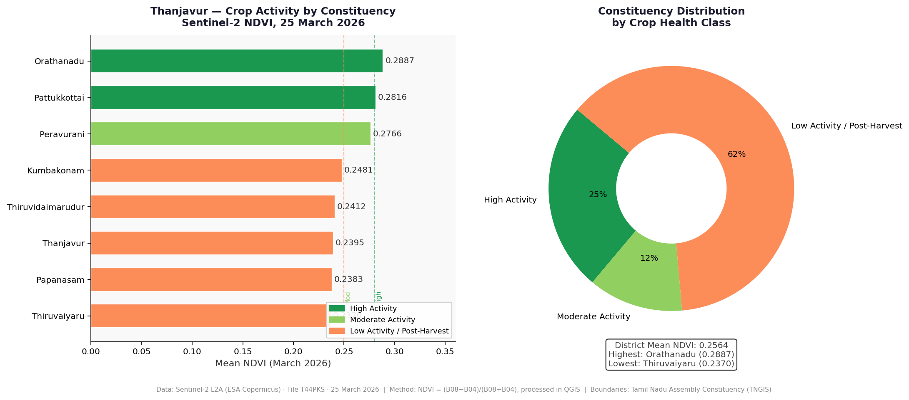
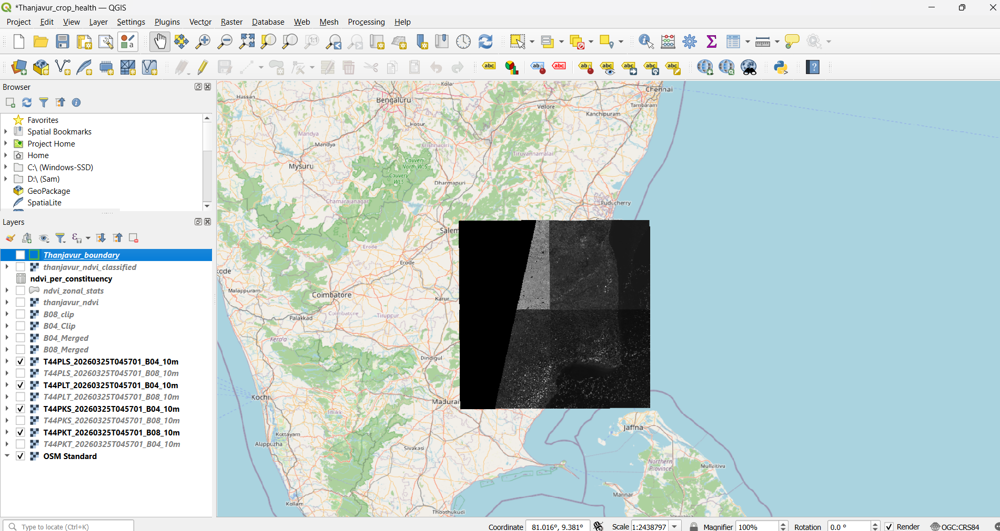
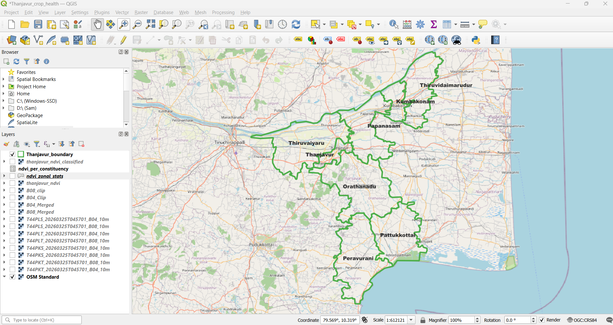
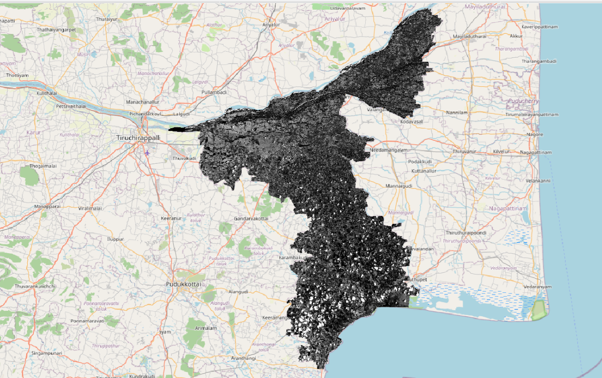

# Thanjavur Crop Health Monitoring — Sentinel-2 NDVI Analysis

**Constituency-level crop activity mapping for Thanjavur district using real Sentinel-2 satellite imagery, processed entirely from open data sources.**


---

## The Problem

Thanjavur is Tamil Nadu's rice bowl — over 3 lakh hectares of agricultural land fed by the Cauvery delta canal network. Agri-input companies, insurance providers, and government programmes (PM-KISAN, PMFBY) need to know WHERE crops are active and WHERE fields are stressed — but traditionally this requires expensive field surveys.

Satellite-derived NDVI provides the same information at district scale in hours, not weeks.

---

## Key Findings



| Rank | Constituency | Mean NDVI | Crop Health Class |
|---|---|---|---|
| 1 | Orathanadu | 0.2887 | High Activity |
| 2 | Pattukkottai | 0.2816 | High Activity |
| 3 | Peravurani | 0.2766 | Moderate Activity |
| 4 | Kumbakonam | 0.2481 | Low / Post-Harvest |
| 5 | Thiruvidaimarudur | 0.2412 | Low / Post-Harvest |
| 6 | Thanjavur | 0.2395 | Low / Post-Harvest |
| 7 | Papanasam | 0.2383 | Low / Post-Harvest |
| 8 | Thiruvaiyaru | 0.2370 | Low / Post-Harvest |

**District mean NDVI: 0.2564**

> **Seasonal context:** March is the post-Samba harvest transition period. High-NDVI areas (Orathanadu, Pattukkottai) reflect active irrigated perennial crops — sugarcane and garden crops along the Cauvery tail-end canals. Low-NDVI areas are healthy fallow fields resting between seasons, not stressed crops.

---

## Why This Date?

The imagery date (25 March 2026) was selected as the **most recent cloud-free Sentinel-2 acquisition** available for Thanjavur district at the time of analysis. Cloud cover below 10% was required — a consistent constraint in Tamil Nadu due to seasonal cloud patterns.

**What March means agriculturally:**

Thanjavur follows two main crop seasons:
- **Samba (Aug–Jan):** the major rice season, harvested November–January
- **Kuruvai (Jun–Sep):** the early rice season
- **March** sits in the inter-season gap — post-Samba harvest, pre-Kuruvai planting

This means the March NDVI captures:
- **Active green pixels** = irrigated perennial crops (sugarcane, banana, vegetables) that grow year-round regardless of season — concentrated along Cauvery canal command areas
- **Low/fallow pixels** = rice fields resting between seasons — healthy, expected, not a sign of crop failure

> **For a complete picture of rice crop health**, the ideal imagery dates are **October–November** (peak Samba growth) and **July–August** (peak Kuruvai growth). This project establishes the inter-season baseline. The Roadmap section describes how multi-date analysis will track the full crop cycle.


---

## NDVI Classification

| Class | NDVI Range | Meaning |
|---|---|---|
| Healthy | ≥ 0.50 | Dense active vegetation |
| Moderate | 0.30 – 0.50 | Partial / early-stage crops |
| Stressed | 0.10 – 0.30 | Sparse or post-harvest |
| Bare / Fallow | 0 – 0.10 | Resting fields |

---

## Who This Is For

| Organisation | Use Case |
|---|---|
| Agri-input companies (Coromandel, UPL, Bayer) | Target field reps to active-crop constituencies |
| Crop insurance (PMFBY) | Flag stressed areas for early loss assessment |
| TNAU / Agricultural Department | Monitor seasonal crop area and health |
| FPOs / Farmer Producer Organisations | Plan input procurement by active crop area |
| Banks / Kisan Credit Card | Calibrate seasonal lending exposure by constituency |

---

## Data Pipeline

```
1. Download   →  Sentinel-2 L2A tiles from ESA Copernicus Browser (free)
2. Process    →  Merge tiles, clip to district boundary, assign CRS (QGIS)
3. Calculate  →  NDVI = (B08 - B04) / (B08 + B04) via Raster Calculator (QGIS)
4. Classify   →  4-class crop health raster (QGIS Raster Calculator)
5. Extract    →  Zonal statistics per constituency (QGIS Processing Toolbox)
6. Analyse    →  Python — ranking, classification, chart generation
```

---

## QGIS Workflow

The entire analysis was built on real satellite data processed in QGIS before any Python work.

### Step 1 — Raw Sentinel-2 tiles downloaded from ESA Copernicus

Four tiles were required to cover the full Thanjavur district extent:


*Four Sentinel-2 L2A tiles (T44PKS, T44PKT, T44PLT, T44PLS) downloaded from ESA Copernicus Browser, 25 March 2026*

### Step 2 — Constituency boundaries loaded

Official Tamil Nadu assembly constituency boundaries used for zonal statistics:


*Official Tamil Nadu Assembly Constituency boundaries (TNGIS) — 8 constituencies covering Thanjavur district*

### Step 3 — B04 (Red band) clipped to boundary

After merging all four tiles, the Red band was clipped precisely to the Thanjavur boundary:


*Sentinel-2 B04 (Red band, 665nm) clipped to Thanjavur district boundary — raw reflectance values, pre-NDVI calculation*

### Step 4 — NDVI calculated and classified

NDVI computed via Raster Calculator: `(B08 - B04) / (B08 + B04)`, then classified into 4 crop health zones.

---

## Tech Stack

- **QGIS** — tile merging, clipping, NDVI calculation, classification, zonal statistics
- **Sentinel-2 L2A** — Band 4 (Red 665nm) + Band 8 (NIR 842nm) at 10m resolution
- **Python** — pandas, matplotlib (analysis and charts)
- **Boundaries** — Tamil Nadu Assembly Constituency shapefile (TNGIS)

---

## Repository Structure

```
thanjavur-crop-health/
├── data/
│   ├── raw/              # Sentinel-2 bands (B04, B08)
│   └── processed/        # ndvi_per_constituency.json, CSV
├── notebooks/
│   ├── 01_data_prep.ipynb
│   ├── 02_ndvi_analysis.ipynb
│   └── 03_visualization.ipynb
├── assets/
│   ├── thanjavur_crop_health_map.png     # Hero NDVI map (QGIS Print Layout)
│   ├── thanjavur_crop_health_charts.png  # Ranking chart + distribution
│   ├── Sentinel2_Imagery.png             # Raw tiles working view
│   ├── boundary.png                      # Constituency boundaries
│   └── B04_clipped_boundary.png          # Clipped Red band
└── README.md
```

---

## Roadmap (v2)

- **Multi-date time series** — compare March vs August NDVI to track the full Samba → Kuruvai crop cycle
- **Kharif season analysis** — repeat for June–September to capture Kuruvai/Samba planting
- **Crop type classification** — distinguish rice from sugarcane using multi-temporal NDVI signature
- **Automated pipeline** — Google Earth Engine script for monthly NDVI monitoring without manual downloads

---

*Built with open data. Reproducible methodology.*
*Author: [Your Name] | [LinkedIn] | [Email]*
*Data: ESA Copernicus Sentinel-2 | TNGIS Tamil Nadu boundaries | Processing: QGIS + Python*
